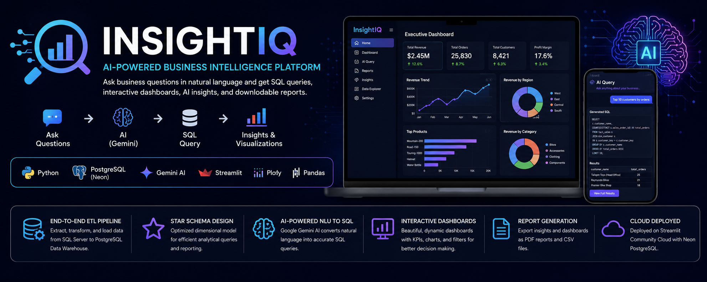
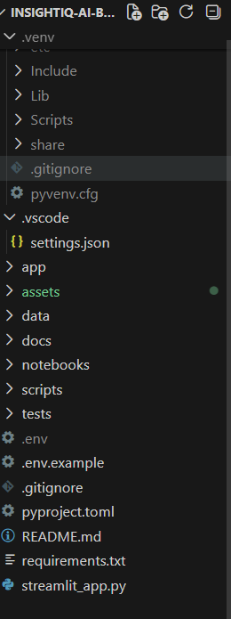
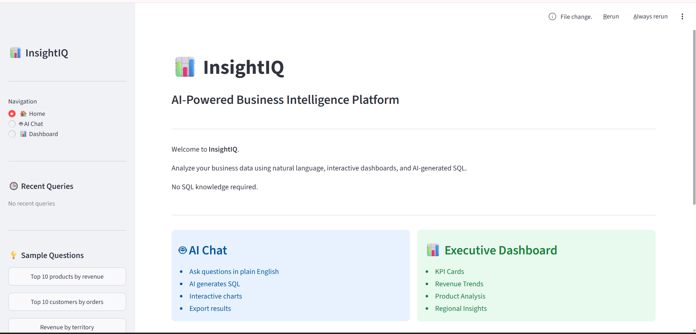
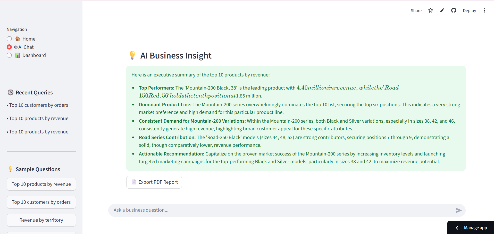
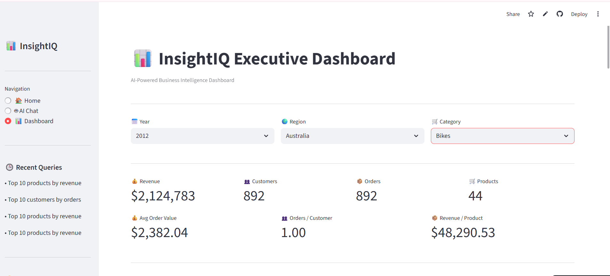

<p align="center">
  
</p>

<h1 align="center">🚀 InsightIQ – AI-Powered Business Intelligence Platform</h1>

<p align="center">
Transform natural language into SQL queries, interactive dashboards, AI-powered business insights, and downloadable reports.
</p>

<p align="center">


</p>

---

# 🌐 Live Demo

🚀 **Application**

https://insightiq-ai-business-intelligence-wsc6fpt7batscbbbz7czmh.streamlit.app/

💻 **GitHub Repository**

https://github.com/sreejamandhadapu2/InsightIQ-AI-Business-Intelligence

---

# 📌 Project Overview

InsightIQ is an end-to-end AI-powered Business Intelligence platform that enables users to analyze enterprise data using natural language instead of writing SQL queries.

The platform leverages **Google Gemini AI** to convert business questions into optimized SQL queries, executes them on a **PostgreSQL (Neon) Data Warehouse**, and presents results through interactive dashboards, KPI cards, AI-generated business insights, dynamic visualizations, and downloadable PDF reports.

This project demonstrates practical skills in:

- Business Intelligence
- Data Analytics
- Data Engineering
- SQL
- Artificial Intelligence
- ETL Pipelines
- Dashboard Development
- Cloud Deployment

---

# ⭐ Key Highlights

- ✅ AI-Powered Natural Language to SQL
- ✅ End-to-End ETL Pipeline
- ✅ Star Schema Data Warehouse
- ✅ Executive Business Dashboard
- ✅ Interactive KPI Analytics
- ✅ Business Health Score
- ✅ Business Alerts
- ✅ Dynamic Visualizations
- ✅ AI Business Insights
- ✅ PDF Report Generation
- ✅ CSV Export
- ✅ Streamlit Cloud Deployment
- ✅ PostgreSQL (Neon) Cloud Database

---

# ✨ Features

## 🤖 AI-Powered Analytics

- Natural Language to SQL using Google Gemini AI
- AI SQL Validation
- AI Query Interpretation
- AI Business Insights
- Intelligent Query Recommendations

---

## 📊 Executive Dashboard

- Executive Summary
- Interactive KPI Cards
- Business Health Score
- Business Alerts
- Revenue Trends
- Revenue by Region
- Revenue by Category
- Top Products
- Dashboard Filters

---

## 📈 Reporting & Visualization

- Interactive Plotly Charts
- Dynamic Dashboards
- PDF Report Export
- CSV Export
- Business Performance Reports

---

## 🏗 Data Engineering

- SQL Server Data Extraction
- ETL Pipeline
- Data Cleaning & Transformation
- Star Schema Data Warehouse
- PostgreSQL (Neon)
- Optimized SQL Queries

---

# 🏛 System Architecture

<p align="center">

</p>

---

# 🛠 Technology Stack

| Category | Technologies |
|-----------|--------------|
| Programming | Python, SQL |
| Frontend | Streamlit |
| Database | SQL Server, PostgreSQL (Neon) |
| AI | Google Gemini AI |
| ORM | SQLAlchemy |
| Data Processing | Pandas |
| Visualization | Plotly |
| Reporting | ReportLab |
| Version Control | Git, GitHub |

---

# 📂 Project Structure

```text
InsightIQ-AI-Business-Intelligence/
│
├── assets/
│   ├── banner.png
│   ├── logo.png
│   ├── architecture.png
│   ├── home.png
│   ├── executive-dashboard-1.png
│   ├── ai-query-1.png
│   ├── business-insights.png
│   ├── dashboard-filters.png
│   └── pdf-report-1.png
│
├── app/
├── tests/
├── streamlit_app.py
├── requirements.txt
├── README.md
└── .gitignore
```

---

# 📷 Application Screenshots

## 🏠 Home Page

<p align="center">

</p>

---

## 📊 Executive Dashboard

<p align="center">

</p>

---

## 🤖 AI Query Interface

<p align="center">

</p>

---

## 💡 AI Business Insights

<p align="center">

</p>

---

## 📄 PDF Report

<p align="center">

</p>

---

## 🎛 Dashboard Filters

<p align="center">

</p>

---

# ⚙ Installation

Clone the repository

```bash
git clone https://github.com/sreejamandhadapu2/InsightIQ-AI-Business-Intelligence.git
```

Navigate to the project

```bash
cd InsightIQ-AI-Business-Intelligence
```

Install dependencies

```bash
pip install -r requirements.txt
```

Configure your environment variables

```env
POSTGRES_HOST=
POSTGRES_PORT=
POSTGRES_DATABASE=
POSTGRES_USER=
POSTGRES_PASSWORD=
GEMINI_API_KEY=
```

Run the application

```bash
streamlit run streamlit_app.py
```

---

# 🚀 Future Enhancements

- User Authentication
- Role-Based Access Control
- Multi-User Support
- Scheduled Reports
- Email Notifications
- Predictive Analytics
- Sales Forecasting
- REST API Integration
- Real-Time Data Streaming

---

# 🎯 Learning Outcomes

Through this project, I gained hands-on experience in:

- Building ETL Pipelines
- Designing Star Schema Data Warehouses
- SQL Query Optimization
- AI-Powered Natural Language to SQL
- Dashboard Development
- Interactive Data Visualization
- PostgreSQL Data Warehousing
- Cloud Deployment
- Business Intelligence Reporting
- End-to-End Software Development

---

# 👩‍💻 Author

## **Sreeja Mandhadapu**

**B.Tech – Computer Science & Engineering (Data Science)**

Aspiring **Data Analyst | Business Intelligence Developer | Data Engineer**

💼 LinkedIn: https://www.linkedin.com/in/sreeja-mandhadapu/

💻 GitHub: https://github.com/sreejamandhadapu2

---

# 🌟 Support

If you found this project useful or interesting,

⭐ Star this repository

🍴 Fork the repository

💬 Share your feedback

---

<p align="center">

Made with ❤️ using Python, Streamlit, PostgreSQL, Google Gemini AI, Plotly & SQLAlchemy.

</p>
